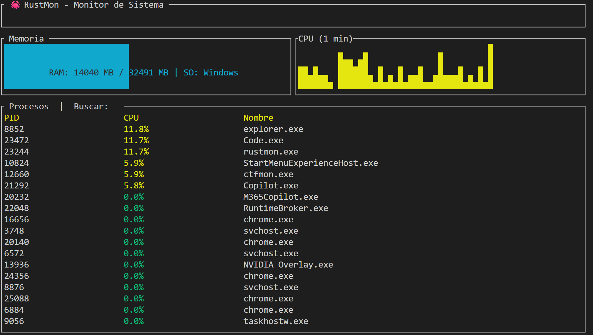

Título: RustMon 🦀

Descripción: Monitor de sistema ligero escrito en Rust con interfaz TUI.

Features:

    -Monitorización de CPU/RAM en tiempo real.

    -Gráficos históricos (Sparklines).

    -Filtrado de procesos en vivo.

    -Gestión de procesos (Kill command).

Instalación: git clone ... y cargo run.